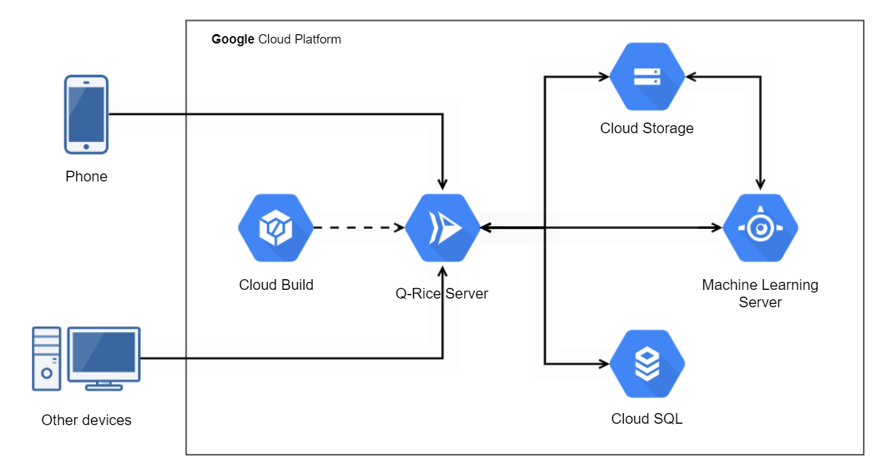

# Q-RICE API 🌾

Welcome to the Q-RICE API! This API serves as the backend for the Q-RICE project, providing endpoints for machine learning predictions related to rice varieties, diseases, nutrient deficiencies, and seed quality.

## Getting Started

To get started with the Q-RICE API, follow these steps:

### Clone the Repository

```bash
git clone https://github.com/amrimuf/qrice
cd qrice
```

### Download Machine Learning Models
Download the required machine learning models from [here](https://drive.google.com/drive/folders/1W8ZBpN2q0HbqfHAeBz7CwURtnNbGScuq?usp=sharing) and place them into the `./models` folder.

### Set Up the Machine Learning Server
Navigate to the `ml-server` directory and install the required Python dependencies:
```bash
cd ml-server
pip install -r requirements.txt
```
Start the ML server by running:
```bash
python main.py
```

### Set Up the API
Navigate to the api directory and install the required Node.js dependencies:
```bash
cd ../api
npm install
```
Copy the `.env.example` file and configure the `.env` file with your environment variables:
```bash
cp .env.example .env
```
Run Sequelize commands to create, migrate, and seed the database:
```bash
sequelize db:create
sequelize db:migrate
sequelize db:seed:all
```
Run the API server in development mode, use:
```bash 
npm run dev
```
## GCP Architecture

